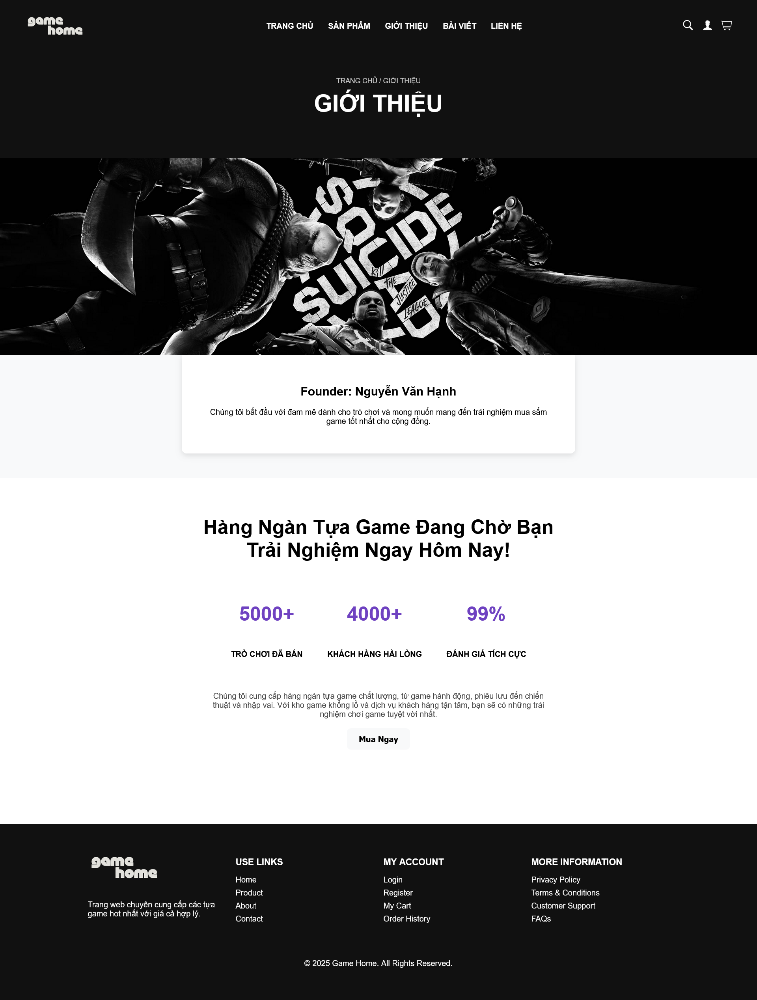
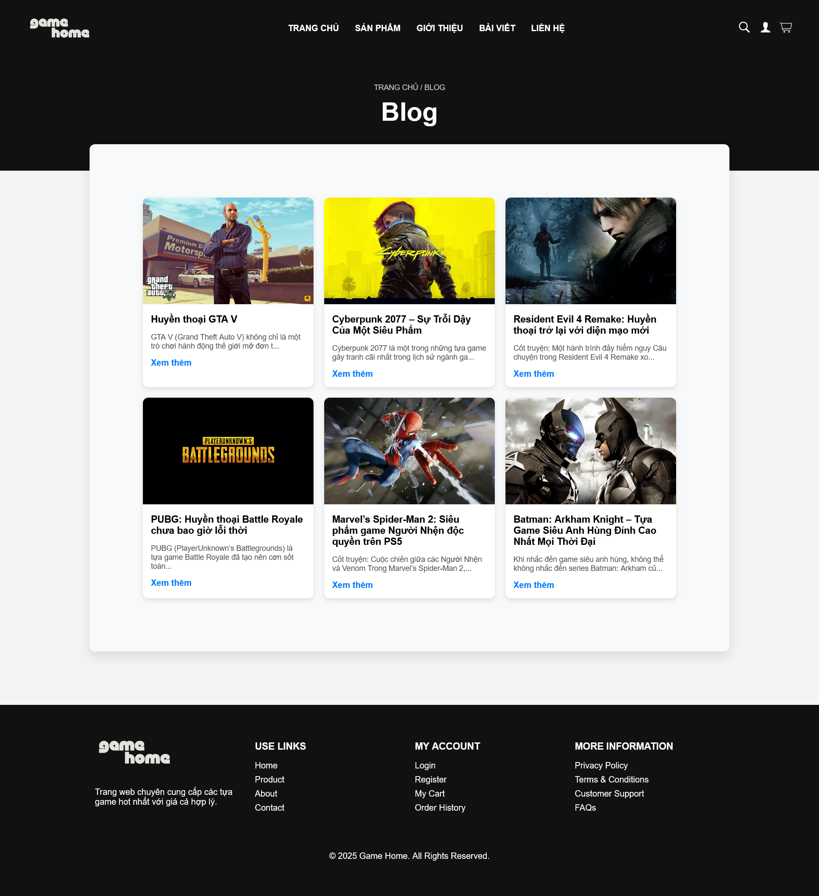
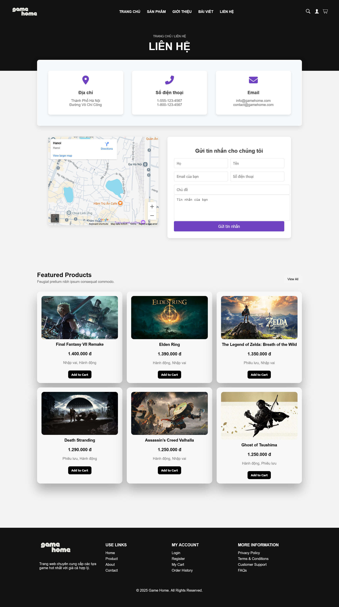

# 🕹️ Website Bán Trò Chơi Điện Tử

## 📖 Giới thiệu

Đây là một **website thương mại điện tử bán trò chơi điện tử** được xây dựng bằng PHP và MySQL.
Website cho phép người dùng duyệt và tìm kiếm game, thêm sản phẩm vào giỏ hàng, quản lý tài khoản, và thanh toán trực tuyến bằng **Stripe API**.
Ngoài ra, hệ thống còn có giao diện quản trị giúp quản lý sản phẩm, đơn hàng, tài khoản, đánh giá và nội dung blog.

---

## 🚀 Tính năng chính

### Người dùng:

* Đăng ký, đăng nhập, quản lý tài khoản.
* Tìm kiếm, xem chi tiết game.
* Thêm game vào giỏ hàng.
* Thanh toán trực tuyến qua **Stripe API**.
* Xem lịch sử mua hàng, viết đánh giá và bình luận.

### Quản trị viên:

* Quản lý sản phẩm (thêm, sửa, xóa).
* Quản lý tài khoản người dùng.
* Quản lý đơn hàng, giỏ hàng.
* Quản lý bài viết và tin tức.
* Xem báo cáo thống kê hệ thống.

---

## 🛠️ Công nghệ sử dụng

* **PHP**: Xử lý logic server.
* **MySQL**: Lưu trữ dữ liệu.
* **HTML, CSS, JavaScript**: Xây dựng giao diện web.
* **phpMyAdmin**: Quản lý cơ sở dữ liệu.
* **WAMP/XAMPP**: Môi trường phát triển.
* **Stripe API**: Thanh toán trực tuyến bằng thẻ Visa/MasterCard.

---

## 📂 Cấu trúc thư mục

* `HOME/` → Trang chủ
* `PRODUCT/` → Danh sách & chi tiết sản phẩm
* `CART/` → Giỏ hàng
* `CHECKOUT/` → Thanh toán (Stripe API)
* `USER/` → Quản lý tài khoản
* `BLOG/` → Bài viết & tin tức
* `CONTACT/` → Liên hệ
* `CRUDadmin/` → Quản trị hệ thống

---

## 💻 Cài đặt & chạy thử

1. Cài đặt **WAMP/XAMPP**.
2. Clone dự án:

   ```bash
   git clone https://github.com/<username>/<repository>.git
   ```
3. Copy source code vào `www/` (WAMP) hoặc `htdocs/` (XAMPP).
4. Import file SQL vào **phpMyAdmin** để tạo CSDL.
5. Chỉnh sửa file `connect.php` với thông tin MySQL.
6. Cấu hình **Stripe API key** trong `process_payment.php`:

   ```php
   \Stripe\Stripe::setApiKey('your_stripe_secret_key');
   ```
7. Mở website tại:

   ```
   http://localhost/BTL.PHPWEB/HOME/Home.php
   ```

---

## 📸 Hình ảnh minh họa


<p align="center">
  
  
  
</p>

<p align="center">
  
  
</p>


---

## 📊 Hướng phát triển

* Tích hợp thêm các cổng thanh toán khác (VNPay, Momo, PayPal).
* Xây dựng ứng dụng di động đồng bộ với website.
* Bổ sung chatbot hỗ trợ khách hàng.

---

